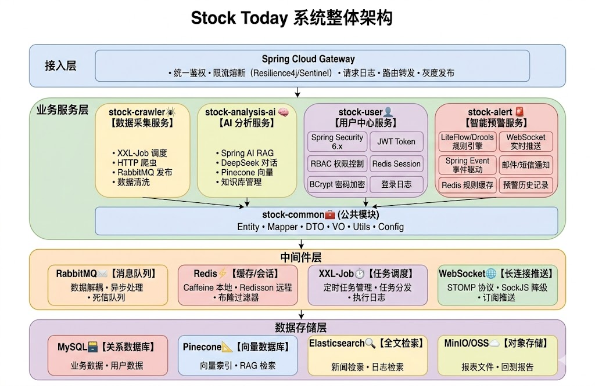

<div align="center">

# 📈 Stock Today - AI 智能股票分析平台


**基于 Spring AI + RAG 的智能化股票分析系统**

[特性](#-项目特性) • [技术架构](#-技术架构) • [快速开始](#-快速开始) • [功能展示](#-功能展示) • [项目结构](#-项目结构)

</div>

---

## 📖 项目介绍

**Stock Today** 是一个多模块的 AI 驱动股票分析平台，整合了**数据采集**、**智能处理**和**AI 问答**三大核心能力。

系统通过定时爬虫采集全球股市数据（A 股、美股、港股等），利用 RAG（检索增强生成）技术进行向量化处理，最终通过 DeepSeek 大模型提供智能化的股票分析问答服务。

### 核心价值

- 🔄 **实时数据采集** - 定时爬取国内外主要股市指数和个股实时数据
- 🧠 **AI 智能分析** - 基于 Spring AI + DeepSeek 的 RAG 问答系统
- 📊 **向量化存储** - Pinecone 向量数据库支持高效语义检索
- 🚀 **高可用架构** - RabbitMQ 消息队列解耦，支持水平扩展

---

## 🏗️ 技术架构

### 技术栈总览

| 技术领域 | 技术选型 | 版本 | 作用说明 |
|---------|---------|------|---------|
| **后端框架** | Spring Boot | 3.2.5 | 核心应用框架 |
| **开发语言** | Java | 17 | 主要编程语言 |
| **AI 框架** | Spring AI | 1.0.0 | LLM 集成框架 |
| **大模型** | DeepSeek | deepseek-chat | 智能对话模型 |
| **嵌入模型** | Alibaba DashScope | text-embedding-v3 | 文本向量化 |
| **向量数据库** | Pinecone | - | 向量存储与检索 |
| **关系数据库** | MySQL | 8.0+ | 业务数据存储 |
| **ORM 框架** | MyBatis | 3.5.16 | 数据访问层 |
| **消息队列** | RabbitMQ | 3.12+ | 异步消息解耦 |
| **任务调度** | XXL-Job | 2.4.0 | 分布式任务调度 |
| **缓存** | Caffeine | - | 本地缓存 |
| **限流** | Resilience4j | 2.2.0 | 请求限流保护 |
| **API 文档** | Knife4j | 4.5.0 | OpenAPI 3 文档 |
| **工具库** | Guava, Commons Lang3 | - | 通用工具类 |

### 系统架构图

<div align="center">



*图 1: Stock Today 系统架构设计*

</div>

### 数据流转

```
XXL-Job 定时触发
       │
       ▼
stock-crawler 爬取数据 ──▶ RabbitMQ ──▶ stock-analysis-ai 消费
                                                    │
                      ┌─────────────────────────────┼─────────────────────┐
                      ▼                             ▼                     ▼
                MySQL 存储                    Pinecone 向量化        DeepSeek AI 回答
```

---

## ✨ 功能展示

### ✅ 已实现功能

#### 📊 数据采集模块（stock-crawler）
- [x] **国内行情采集** - 采集上证指数、深证成指等 A 股市场数据
- [x] **个股实时数据** - 采集个股实时行情、涨跌幅、成交量等信息
- [x] **海外市场采集** - 采集道琼斯、纳斯达克、恒生指数等全球主要股指
- [x] **XXL-Job 调度** - 支持分布式定时任务调度
- [x] **RabbitMQ 消息发布** - 数据发布到消息队列，解耦生产消费

#### 🤖 AI 分析模块（stock-analysis-ai）
- [x] **RAG 知识检索** - 基于 Pinecone 的向量检索增强生成
- [x] **DeepSeek 智能问答** - 同步/流式 AI 对话接口
- [x] **知识库管理** - 静态知识库文件向量化存储
- [x] **股票数据查询** - K 线数据、实时行情查询接口
- [x] **API Key 管理** - 多 Key 负载均衡 + 429 限流自动冷却
- [x] **Resilience4j 限流** - 请求限流保护
- [x] **Caffeine 缓存** - 本地缓存加速
- [x] **Knife4j API 文档** - 在线接口文档

#### 🔧 公共模块（stock-common）
- [x] **实体类定义** - 股票、用户、权限等实体
- [x] **Mapper 接口** - MyBatis 数据访问接口
- [x] **DTO/VO 定义** - 数据传输对象和视图对象
- [x] **工具类** - 日期处理、ID 生成、数据解析等

### 🚧 待开发功能

- [ ] **用户权限系统** - 基于角色的访问控制（RBAC）
- [ ] **前端管理界面** - Vue3 + Element Plus 管理后台
- [ ] **K 线图表展示** - ECharts 股票 K 线图可视化
- [ ] **智能选股** - 基于 AI 的股票推荐和筛选
- [ ] **情绪分析** - 新闻资讯的情感倾向分析
- [ ] **预警推送** - 股价异动微信/邮件通知
- [ ] **数据导出** - Excel 数据导出功能

---

## 🚀 快速开始

### 环境要求

| 软件 | 最低版本 | 推荐版本 |
|------|---------|---------|
| JDK | 17 | 17+ |
| Maven | 3.8 | 3.9+ |
| MySQL | 8.0 | 8.0+ |
| RabbitMQ | 3.10 | 3.12+ |
| XXL-Job | 2.3 | 2.4.0 |

### 1. 克隆项目

```bash
git clone https://github.com/your-username/stock-today.git
cd stock-today
```

### 2. 配置环境变量

在项目根目录创建 `.env` 文件，配置以下环境变量：

```bash
# MySQL 配置
MYSQL_HOST=127.0.0.1
MYSQL_PORT=3306
MYSQL_DATABASE=stock_analysis
MYSQL_USERNAME=root
MYSQL_PASSWORD=your_password

# RabbitMQ 配置
RABBITMQ_HOST=127.0.0.1
RABBITMQ_PORT=5672
RABBITMQ_USERNAME=guest
RABBITMQ_PASSWORD=guest

# DeepSeek API Key
DEEPSEEK_API_KEY=your_deepseek_api_key

# 阿里云百炼 API Key（Embedding）
ALIYUN_DASHSCOPE_API_KEY=your_dashscope_api_key

# Pinecone 配置
PINECONE_API_KEY=your_pinecone_api_key
PINECONE_INDEX_NAME=stock-analysis-index
```

### 3. 数据库初始化

```sql
-- 创建数据库
CREATE DATABASE IF NOT EXISTS stock_analysis DEFAULT CHARACTER SET utf8mb4;
USE stock_analysis;

-- 执行 SQL 脚本（位置：scripts/init.sql）
source scripts/init.sql
```

### 4. 构建项目

```bash
# 构建整个项目
mvn clean install -DskipTests

# 或分别构建各模块
mvn clean package -pl stock-common -am
mvn clean package -pl stock-crawler -am
mvn clean package -pl stock-analysis-ai -am
```

### 5. 启动服务

#### 方式一：使用脚本（推荐）

```bash
# 启动 stock-crawler（数据采集服务）
sh scripts/load-env.sh stock-crawler

# 启动 stock-analysis-ai（AI 分析服务）
sh scripts/load-env.sh stock-analysis-ai
```

#### 方式二：手动启动

```bash
# 启动 stock-crawler（端口 8090）
java -jar stock-crawler/target/stock-crawler-1.0.0.jar \
  --spring.profiles.active=mq,xxljob,stock

# 启动 stock-analysis-ai（端口 8080）
java -jar stock-analysis-ai/target/stock-analysis-ai-1.0.0.jar
```

### 6. 验证服务

```bash
# 检查 AI 服务健康状态
curl http://localhost:8080/actuator/health

# 检查 API 文档
curl http://localhost:8080/swagger-ui.html

# 检查 MQ 状态
curl http://localhost:8080/api/mq/status
```

### 7. 配置 XXL-Job

访问 XXL-Job 管理后台，添加以下执行器任务：

| 任务名称 | 执行器 | 调度类型 | Cron 表达式 |
|---------|--------|---------|------------|
| 采集国内行情 | stock-crawler | 自动 | `0 */5 * * * ?` |
| 采集个股数据 | stock-crawler | 自动 | `0 */1 * * * ?` |
| 采集海外行情 | stock-crawler | 自动 | `0 */10 * * * ?` |

---

## 📁 项目结构

```
stock-today/
├── stock-common/                 # 公共模块
│   └── src/main/java/
│       └── com/me/stock/
│           ├── config/           # 配置类
│           │   └── RabbitMQProperties.java
│           ├── entity/           # 实体类
│           │   ├── StockMarketIndexInfo.java
│           │   ├── StockRtInfo.java
│           │   ├── StockOuterMarketIndexInfo.java
│           │   ├── SysUser.java
│           │   └── SysPermission.java
│           ├── mapper/           # MyBatis Mapper
│           │   ├── StockMarketIndexInfoMapper.java
│           │   ├── StockRtInfoMapper.java
│           │   └── SysUserMapper.java
│           ├── pojo/             # 数据对象
│           │   ├── domain/       # 业务领域对象
│           │   ├── dto/          # 数据传输对象
│           │   └── vo/           # 视图对象
│           ├── utils/            # 工具类
│           │   ├── DateTimeUtil.java
│           │   └── IdWorker.java
│           └── exception/        # 异常类
│               └── BusinessException.java
│
├── stock-crawler/                # 数据采集模块（端口：8090）
│   └── src/main/java/
│       └── com/me/spring/
│           ├── jobApplication.java        # 启动类
│           ├── StockTimerTaskService.java # 定时任务服务
│           ├── config/                    # 配置类
│           │   ├── MqConfig.java          # RabbitMQ 配置
│           │   ├── XxlJobConfig.java      # XXL-Job 配置
│           │   ├── HttpClientConfig.java  # HttpClient 配置
│           │   ├── ApiKeyConfig.java      # API Key 配置
│           │   └── TaskExecutePool.java   # 线程池配置
│           └── job/
│               └── StockJob.java          # XXL-Job 任务处理器
│
├── stock-analysis-ai/            # AI 分析模块（端口：8080）
│   └── src/main/java/
│       └── com/me/spring/stockanalysisai/
│           ├── StockAnalysisAiApplication.java  # 启动类
│           ├── controller/          # REST 控制器
│           │   ├── ChatController.java      # 聊天接口
│           │   └── StockController.java     # 股票查询接口
│           ├── service/             # 服务层
│           │   ├── ChatService.java
│           │   ├── StockDataService.java
│           │   ├── VectorStoreService.java
│           │   └── impl/
│           ├── config/              # 配置类
│           │   ├── AIConfig.java            # Spring AI 配置
│           │   ├── RabbitMQConfig.java      # RabbitMQ 配置
│           │   ├── CanalConfig.java         # Canal 配置
│           │   ├── CorsConfig.java          # 跨域配置
│           │   ├── Knife4jConfig.java       # Knife4j 配置
│           │   ├── ApiKeyManager.java       # API Key 管理
│           │   └── RateLimiterProperties.java
│           ├── listener/            # 消息监听器
│           │   ├── StockDataQueueListener.java
│           │   └── CacheInvalidMessageListener.java
│           ├── pojo/                # 数据对象
│           │   ├── request/         # 请求对象
│           │   └── response/        # 响应对象
│           ├── common/              # 公共类
│           │   ├── Result.java
│           │   └── ResultCode.java
│           ├── exception/           # 异常处理
│           │   ├── BusinessException.java
│           │   └── GlobalExceptionHandler.java
│           └── tools/               # 工具类
│               ├── DateTimeTools.java
│               └── StockQueryTool.java
│
└── scripts/                      # 脚本文件
    ├── init.sql                  # 数据库初始化脚本
    └── load-env.sh               # 环境变量加载脚本
```

---

## 📚 技术参考

### Spring AI

本项目使用 [Spring AI](https://docs.spring.io/spring-ai/reference/) 1.0.0 作为 AI 集成框架：

```java
// RAG 配置示例
@Configuration
public class AIConfig {

    @Bean
    public ChatClient chatClient(ChatClient.Builder builder) {
        return builder.build();
    }

    @Bean
    public VectorStore vectorStore(EmbeddingModel embeddingModel) {
        return new PineconeVectorStore(embeddingModel, pineconeConfig);
    }
}
```

**核心组件：**
- `ChatClient` - 与大模型对话的客户端
- `EmbeddingModel` - 文本向量化模型（DashScope）
- `VectorStore` - 向量存储接口（Pinecone 实现）
- `RAG` - 检索增强生成管道

### XXL-Job

[XXL-Job](https://www.xuxueli.com/xxl-job/) 分布式任务调度平台：

```java
@XxlJob("getInnerMarketInfo")
public void getInnerMarketInfo() throws Exception {
    // 采集国内市场行情
    stockTimerTaskService.getInnerMarketInfo();
}
```

### RabbitMQ

消息队列用于解耦数据生产和消费：

```java
// 生产者
@Autowired
private RabbitTemplate rabbitTemplate;

rabbitTemplate.convertAndSend(exchange, routingKey, message);

// 消费者
@RabbitListener(queues = "${stock.rabbitmq.vector-queue}")
public void handleStockData(StockDataMessage message) {
    vectorStoreService.addStockData(message);
}
```

---

## 📝 API 接口

### Chat 接口

| 接口 | 方法 | 描述 |
|------|------|------|
| `/chat` | POST | 同步聊天接口 |
| `/chat/stream` | POST | 流式聊天接口（SSE） |

### Stock 接口

| 接口 | 方法 | 描述 |
|------|------|------|
| `/api/stock/query` | POST | 股票数据查询 |
| `/api/stock/kline` | GET | K 线数据查询 |
| `/api/mq/status` | GET | MQ 连接状态 |
| `/api/mq/queues/info` | GET | 队列信息 |

**API 文档地址：** http://localhost:8080/swagger-ui.html

---

## 🔧 配置说明

### 核心配置文件

| 模块 | 配置文件 | 说明 |
|------|---------|------|
| stock-analysis-ai | `application.yml` | 主配置（AI、RabbitMQ） |
| stock-analysis-ai | `application-db.yml` | 数据库配置 |
| stock-analysis-ai | `application-cache.yml` | 缓存配置 |
| stock-analysis-ai | `application-canal.yml` | Canal 配置 |
| stock-crawler | `application.yml` | 主配置 |
| stock-crawler | `application-mq.yml` | RabbitMQ 配置 |
| stock-crawler | `application-xxljob.yml` | XXL-Job 配置 |
| stock-crawler | `application-stock.yml` | 股票配置 |

---

## 📄 License

本项目采用 [MIT](https://opensource.org/licenses/MIT) 协议开源。

```
Copyright (c) 2024 Stock Today

Permission is hereby granted, free of charge, to any person obtaining a copy
of this software and associated documentation files (the "Software"), to deal
in the Software without restriction, including without limitation the rights
to use, copy, modify, merge, publish, distribute, sublicense, and/or sell
copies of the Software...
```

---

<div align="center">

**🌟 如果这个项目对你有帮助，请给一个 Star！**

[⬆ 返回顶部](#-stock-today---ai-智能股票分析平台)

</div>
